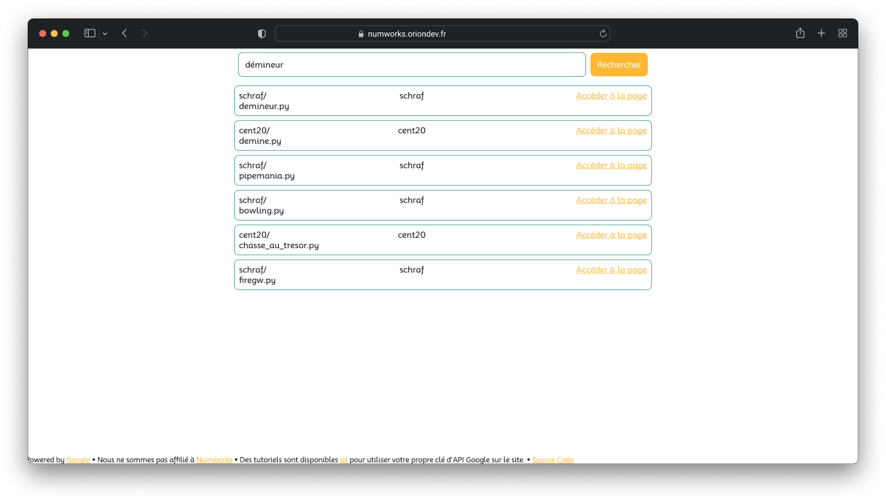

# Numworks Search
C'est un simple site développé en React pour rechercher des programmes pour la calculatrice Numworks.
Nous ne sommes pas affilié à Numworks.
<br> Pour installer votre propre backend, voir [Numworks Search Server](https://github.com/oriionn/numworks-search-server).


[](https://vercel.com/new/clone?repository-url=https%3A%2F%2Fgithub.com%2Foriionn%2Fnumworks-search)

## Installation
1. Cloner le dépôt
```bash
git clone https://github.com/oriionn/numworks-search.git
```
2. Installer les dépendances
```bash
npm install
```
3. Lancer le serveur de développement
```bash
npm start
```
3,5. (Optionnel) Lancer le serveur de production
```bash
npm run build
```

4. Ouvrir [http://localhost:3000](http://localhost:3000) dans votre navigateur.
5. Enjoy !

## Contributeurs


## License
Ce projet est sous license [MIT](LICENSE).